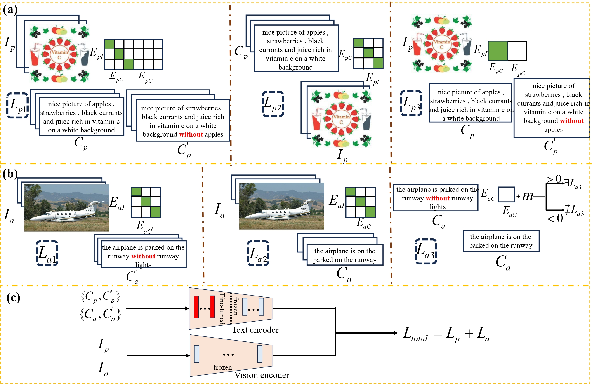

# [CVPR 2026 AI4RWC] Omni-NegCLIP: Enhancing CLIP with Front-Layer Contrastive Fine-Tuning for Comprehensive Negation Understanding

> **TL;DR.** We propose **Omni-NegCLIP**, a fine-tuned CLIP model that improves CLIP’s understanding of two types of negation: **presence-based negation** and **absence-based negation**. These correspond to negated expressions of objects that are actually present in an image and objects that may plausibly exist in an image but are in fact absent, respectively. Omni-NegCLIP achieves this by modifying CLIP’s original InfoNCE contrastive loss.

## Overview

<p align="center">
  
</p>

## Installation

```bash
git clone https://github.com/Jingqi-Xu/Omni-NegCLIP.git
cd Omni-NegCLIP

conda create -n omninegclip python=3.10 -y
conda activate omninegclip

pip install -r requirements.txt
```


## Data Preparation

Omni-NegCLIP is trained and evaluated based on the datasets used in [NegationCLIP](https://github.com/parkquasar/NegationCLIP) and [CoN-CLIP](https://github.com/jaisidhsingh/CoN-CLIP). Please refer to these two repositories for preparing the training and evaluation data.

## Training

After preparing the data, you can run the following script to train Omni-NegCLIP:

```bash
python job_training_omni_negclip.py
```
